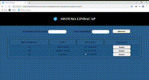
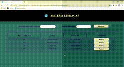

# sistema de cadastro para hospedes

    
    

>Status do projeto: concluído :ballot_box_with_check:

##<strong>Descrição do projeto</strong> :page_facing_up:

Página de cadastro e controle de clientes para o condominio Lindacap Flat Residence.

##<strong>Funcionalidades </strong> :arrow_forward:

:point_right: Campos para a entrada de dados;  
:point_right: Botão para adicionar hospede;
:point_right: Botão para excluir o hospede;

##<strong>Informações </strong> :speaker:

:point_right: Para a instalação, clonar o diretorio e abrir o arquivo no navegador;
:point_right: Banco de dados inexistente, todos os dados ficam gravados diretamente no navegador;
:point_right: Usei como base para o projeto, um video antigo sobre cadastros de estacionamento que se encontra no canal do link:
https://www.youtube.com/channel/UCsaZv7dlu8737N0e44kX66w;